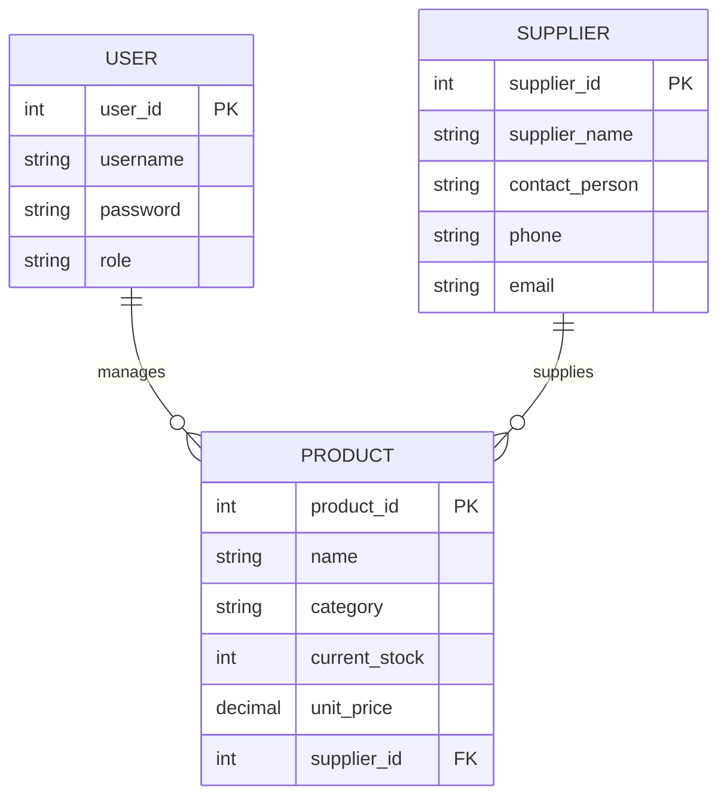

# Inventory Management System (Java GUI) 📦

A professional **Java Desktop Application** designed to streamline stock control, product tracking, and sales management. This project utilizes **Java Swing** for the interface and **JDBC** for database connectivity, ensuring a reliable and user-friendly experience for small to medium-sized businesses.

---


---

## 📸 Project Showcase

### 1. Main Interface
The primary dashboard where users can add items (Push) and view the current inventory list.
<p align="center">
  
</p>

### 2. Remove Item (Pop)
Demonstrating the Stack's "Pop" operation, where the most recently added item is removed first.
<p align="center">
  
</p>

### 3. View Top Item (Peek)
The "Peek" functionality allows users to see the top-most item in the inventory without removing it.
<p align="center">
  
</p>

### 4. Error Handling
The system includes validation to ensure only valid numeric data is entered for quantity and price.
<p align="center">
  
</p>

---

## 🚀 Key Features
* **Product Management:** Full CRUD operations (Create, Read, Update, Delete) for inventory items.
* **Real-time Stock Monitoring:** Automatically track quantities and manage stock levels.
* **User Authentication:** Secure login system to protect inventory data.
* **Supplier Records:** Manage contact information and history for product suppliers.
* **Transaction History:** Keep a detailed log of all sales and stock adjustments.
* **Search & Filters:** Quickly find products by name, ID, or category.

## 🛠️ Tech Stack

* **Language:** Java (JDK 8 or higher)
* **GUI Framework:** Java Swing & AWT
* **Database:** SQL Server / MySQL (via JDBC)
* **IDE:** IntelliJ IDEA / NetBeans / Eclipse

---
## 🚀 Getting Started

### Prerequisites
* Ensure you have **Java Development Kit (JDK)** installed.
* A running **SQL Database** instance.

### Installation & Setup

1.  **Clone the Repository:**
    ```bash
    git clone [https://github.com/bushra-waseem/Inventory-Management-System-Java.git](https://github.com/bushra-waseem/Inventory-Management-System-Java.git)
    ```

2.  **Database Configuration:**
    * Locate the database connection class (usually in the `util` or `database` package).
    * Update the `URL`, `username`, and `password` to match your local database settings.

3.  **Run the Application:**
    * Open the project in your IDE.
    * Run the main entry file (e.g., `Login.java` or `Main.java`).

## 📂 Project Structure

```text
├── src/
│   ├── ui/             # Swing Frames and Panels
│   ├── database/       # DB Connection and Queries
│   ├── models/         # Entity classes (Product, User, etc.)
│   └── main/           # Application entry point
├── assets/             # Icons and UI images
└── README.md
```
